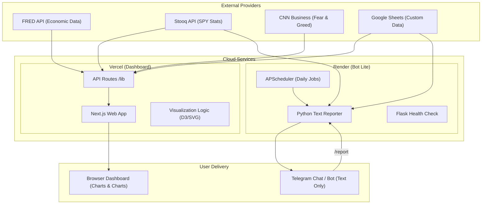

# 🏗️ System Architecture

This project consists of two primary services: an **Interactive Visualization Dashboard** and a **Lightweight Text Reporter**.

## 🛰️ Data Flow Diagram

## 🧩 Component Breakdown

### 1. The Dashboard (Next.js - Full Visual Studio)
- **Deep Dive Visualization**: Handles all complex charting (Yield Curve, Profit Margins, RSI Gagues).
- **Standardized Fetcher**: Uses `lib/fetcher.js` with consistent timeout logic.
- **Business Logic**: Math for RSI and Moving Averages is isolated in `lib/finance.js`.

### 2. The Bot Lite (Python - High Speed)
- **Compact Text Reports**: Focused on immediate, high-value text summaries.
- **Dependency Optimized**: Running without heavy plotting libraries (matplotlib/seaborn) for ultra-fast startup and execution.
- **Integrated Server**: The entrypoint `bot/main.py` runs a Flask server for Render's health checks and an internal scheduler.
- **AI-Friendly**: Fully type-hinted and modular.
