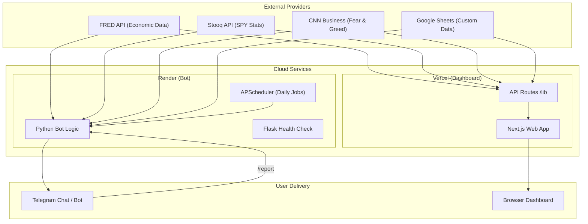

# 🏗️ System Architecture

This project consists of two primary services interacting with external financial data sources and delivering insights to the user.

## 🛰️ Data Flow Diagram

## 🧩 Component Breakdown

### 1. The Dashboard (Next.js)
- **Standardized Fetcher**: Uses a centralized utility in `lib/fetcher.js` with consistent timeout logic.
- **Business Logic**: Math for RSI and Moving Averages is isolated in `lib/finance.js`.
- **Constants**: All FRED Series IDs and external URLs are managed in `lib/constants.js`.

### 2. The Bot Package (Python)
- **Modular Design**: Broken into `fetchers.py`, `charts.py`, `assessment.py`, and `utils.py`.
- **Integrated Server**: The entrypoint `bot/main.py` runs a Flask server for Render's health checks and an internal scheduler.
- **AI-Friendly**: Fully type-hinted to ensure reliable AI-assisted updates.
